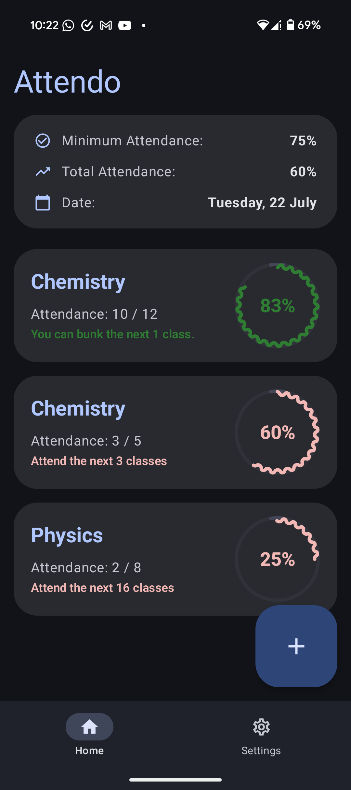
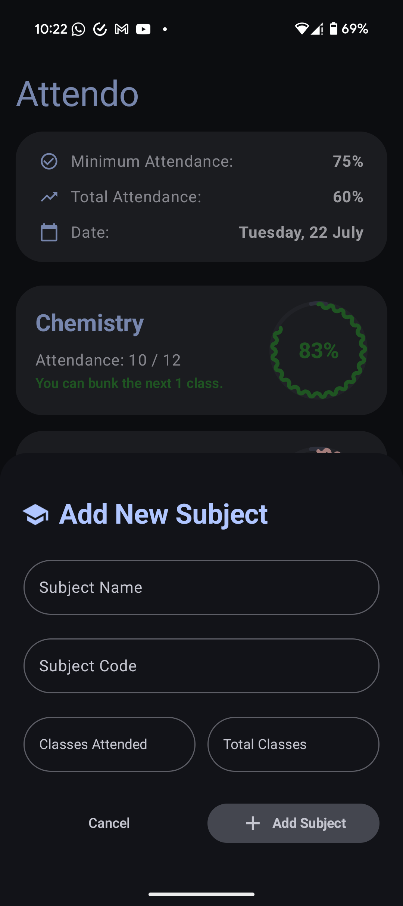
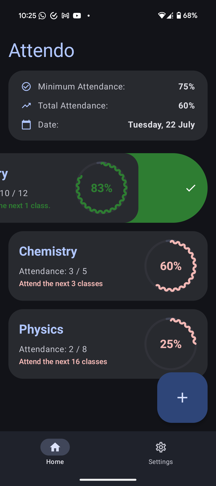
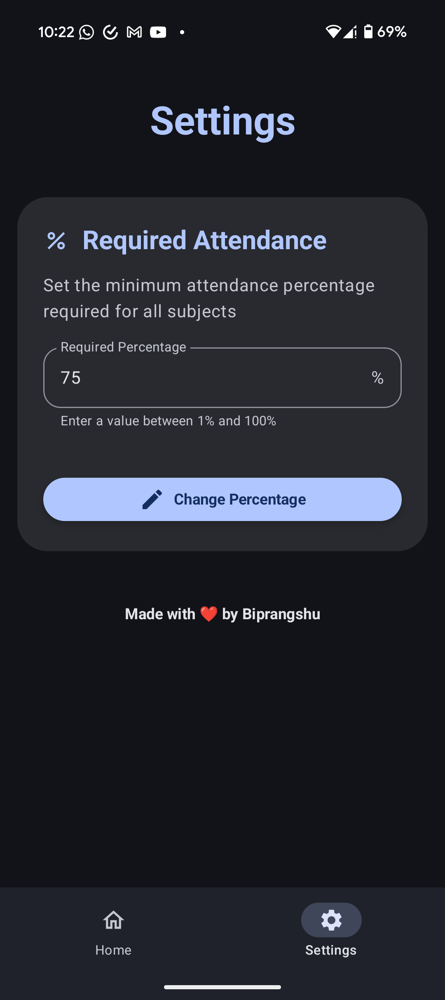
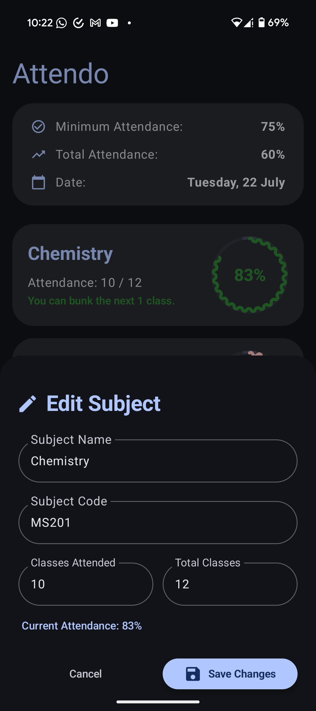
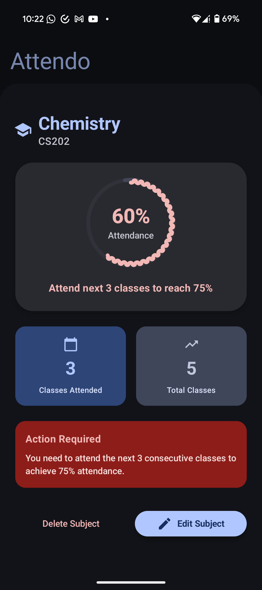

# Attendo

Attendo is an Android application built with Kotlin that helps users manage and track their class attendance efficiently. The app provides features to record, update, and monitor attendance for different subjects, set required attendance percentages, and manage preferences.

## Features

- **Track Attendance:** Add, update, and delete subjects. Mark classes as present or absent to automatically update attendance records.
- **Set Attendance Requirements:** Configure your required attendance percentage to stay notified if you are falling behind.
- **Data Persistence:** Uses Room database to store all attendance records locally.
- **User Preferences:** Manage settings like first-time app open and attendance thresholds using DataStore.
- **Modern Android Architecture:** Built with Jetpack components, ViewModel, Kotlin coroutines, and Hilt for dependency injection.
- **Material Design 3 UI:** Provides a clean, expressive, and adaptive interface.

## Screenshots

<table>
  <tr>
    <td align="center">
      
      <br />
      <sub><b>Home Screen</b></sub>
      <br />
      <sub>Main dashboard showing subjects and attendance overview</sub>
    </td>
    <td align="center">
      
      <br />
      <sub><b>Add Subject</b></sub>
      <br />
      <sub>Form to add new subjects with code and name</sub>
    </td>
    <td align="center">
      
      <br />
      <sub><b>Attendance Tracker</b></sub>
      <br />
      <sub>Track daily attendance with present/absent options</sub>
    </td>
  </tr>
  <tr>
    <td align="center">
      
      <br />
      <sub><b>Subject Details</b></sub>
      <br />
      <sub>Detailed view of individual subject attendance</sub>
    </td>
    <td align="center">
      
      <br />
      <sub><b>Settings</b></sub>
      <br />
      <sub>App preferences and attendance requirements</sub>
    </td>
  </tr>
</table>

### Additional Screenshots

<table>
  <tr>
    <td align="center">
      
      <br />
      <sub><b>Edit Subject</b></sub>
      <br />
      <sub>Modify existing subject information</sub>
    </td>
    <td align="center">
      
      <br />
      <sub><b>Low Attendance Alert</b></sub>
      <br />
      <sub>Warning when attendance falls below threshold</sub>
    </td>
  </tr>
</table>

## Getting Started

### Prerequisites
- Android Studio (latest version recommended)
- Android device or emulator running Android 5.0 (Lollipop) or later

### Installation
1. Clone this repository:
    ```bash
    git clone https://github.com/jarvis1704/Attendo.git
    ```
2. Open the project in Android Studio.
3. Let Gradle sync and download all dependencies.
4. Build and run the app on your device or emulator.

## Usage

- **Add Subject:** Enter subject details such as code and name to start tracking.
- **Mark Attendance:** Use the present/absent options for each class to update your attendance stats.
- **View Stats:** Instantly see your attendance percentage per subject and check if you meet your set requirement.
- **Settings:** Customize your required attendance percentage and reset app preferences if needed.

## Technologies Used

- Kotlin
- Jetpack Compose
- Room Database
- DataStore Preferences
- Hilt (Dependency Injection)
- Material Design 3

## Contributing

Contributions are welcome! Please fork the repo, create a new branch, and submit a pull request.

## License

This project is currently not licensed. You may use it for learning and personal use.

## Author

[jarvis1704](https://github.com/jarvis1704)
